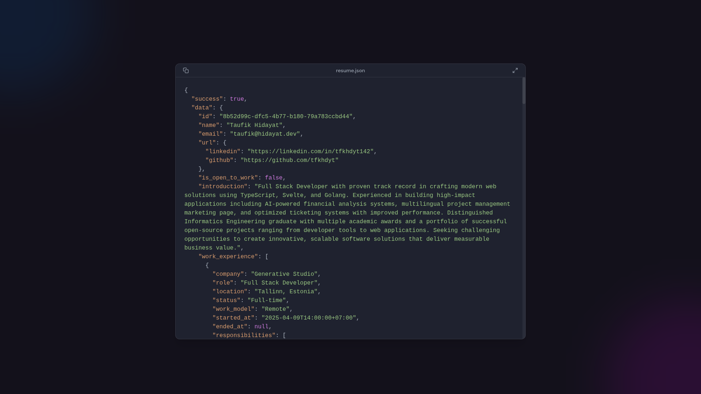

# hidayat.dev

A modern, minimalist portfolio site built with SvelteKit that displays resume data in a beautiful JSON viewer interface.



## 🌟 Features

- Interactive JSON-based resume display
- Sleek, modern UI with background glow effects
- Copy resume data with a single click
- Responsive design that works on all devices
- Maximizable view for better readability
- Built with Svelte 5 and TypeScript
- Styled with Tailwind CSS
- Deployed on Cloudflare Pages

## 🛠️ Tech Stack

- **Frontend**: SvelteKit, Svelte 5, TypeScript
- **Styling**: Tailwind CSS
- **Deployment**: Cloudflare Pages
- **Tools**: Vite, ESLint, Prettier

## 🚀 Getting Started

### Prerequisites

- Node.js (v18+)
- pnpm

### Installation

1. Clone the repository:

   ```bash
   git clone https://github.com/tfkhdyt/portfolio-website.git
   cd portfolio-website
   ```

2. Install dependencies:

   ```bash
   pnpm install
   ```

3. Start the development server:

   ```bash
   pnpm run dev
   ```

4. Open your browser and navigate to `http://localhost:5173`

## 📦 Building for Production

To create a production build:

```bash
pnpm run build
```

Preview the production build:

```bash
pnpm run preview
```

## 🚢 Deployment

This project is configured for Cloudflare Pages deployment:

```bash
pnpm run deploy
```

## 📂 Project Structure

```
portfolio-website/
├── src/
│   ├── lib/
│   │   ├── assets/
│   │   │   └── resume.json      # Resume data in JSON format
│   │   ├── components/          # Reusable components
│   │   └── ...
│   ├── routes/
│   │   ├── +page.svelte         # Main page component
│   │   └── +layout.svelte       # App layout
│   ├── app.css                  # Global styles
│   └── app.html                 # HTML template
├── static/                      # Static assets
├── package.json
└── ...
```

## 🧪 Customization

To use this for your own portfolio:

1. Edit the `src/lib/assets/resume.json` file with your information
2. Customize colors and styling in the components
3. Update metadata in `+page.svelte` (title, description, keywords)

## 📄 License

[MIT](LICENSE)

## 👤 Author

- **Taufik Hidayat** - [tfkhdyt](https://github.com/tfkhdyt)
